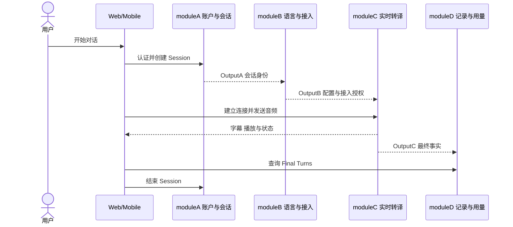
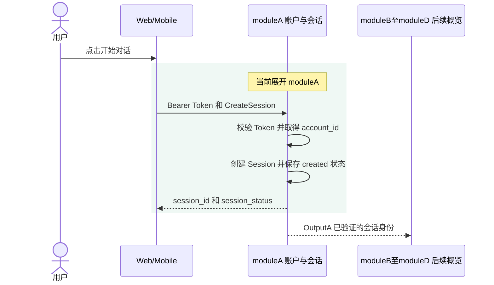
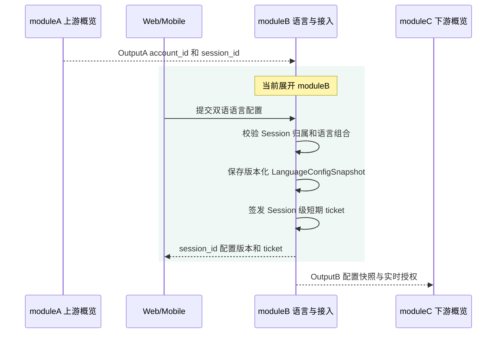
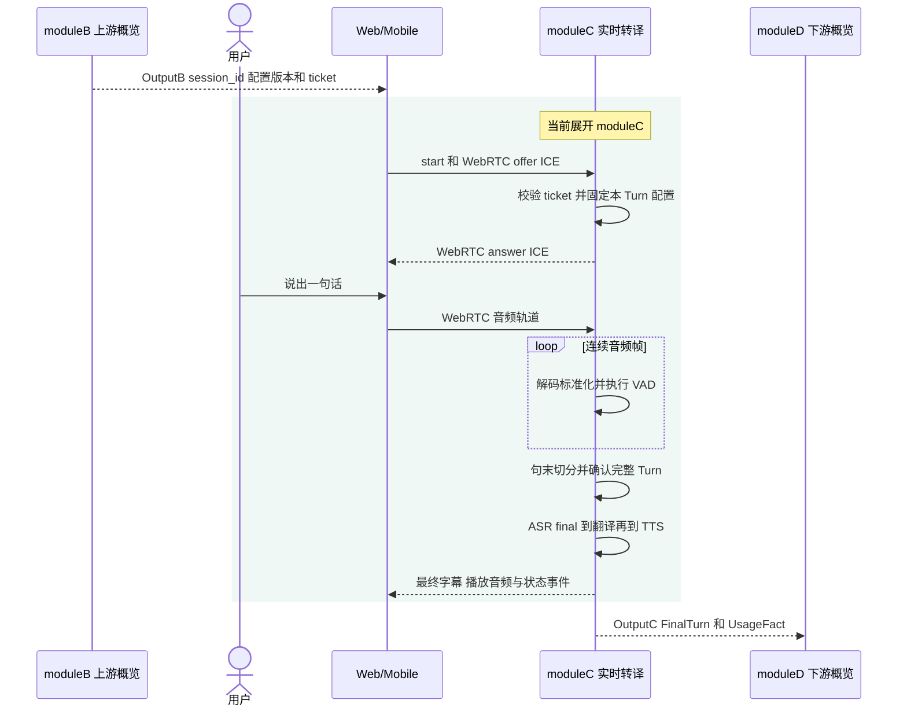
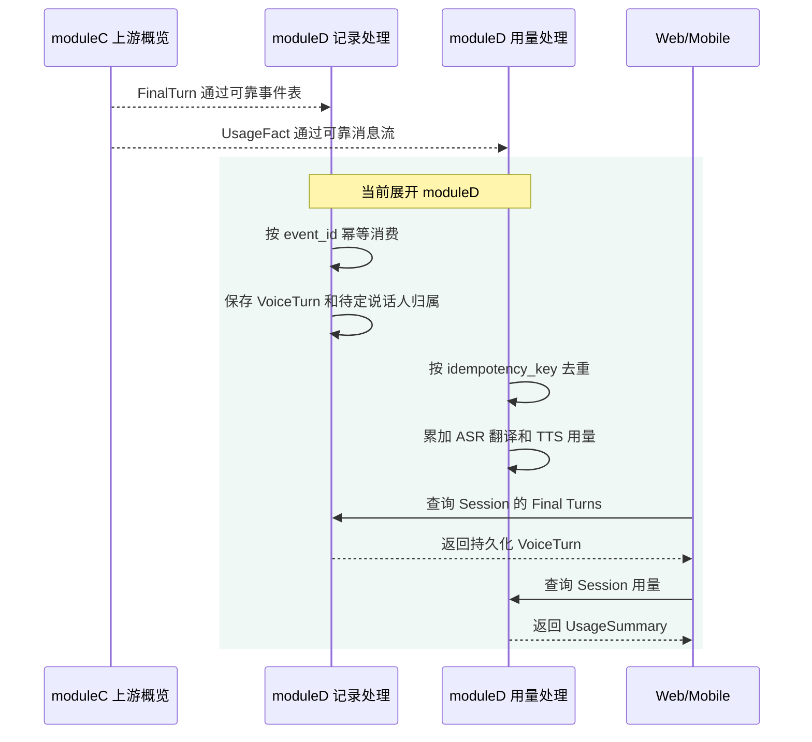
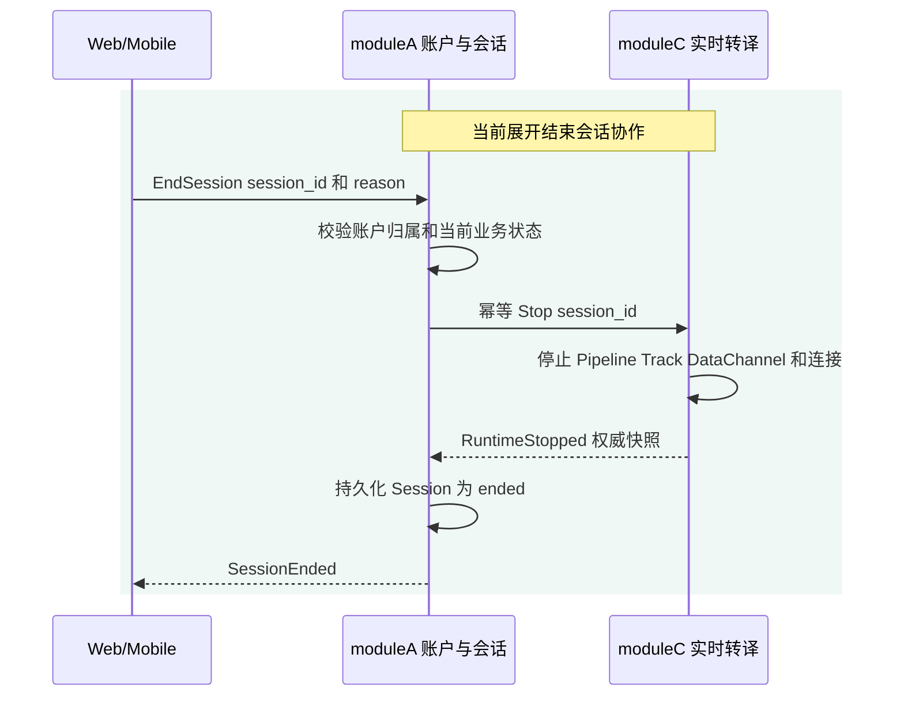

# 用户故事架构链路

## 1. 文档目的

本文用一条可验证的用户故事串联 Lingow 的模块职责、输入输出和关键代码边界。
代码块采用带行尾注释的架构伪代码，不能作为标准 JSON 直接解析。正式字段定义仍以
`packages/contracts` 中的 schema 为准；字段发生变化时，应先更新 contracts，再同步实现和消费者。

## 2. 核心用户故事

用户打开 Web 或 Mobile，选择一组双语语言，开始一场对话；用户说完一句话后，系统完成识别、翻译和语音播放，保存最终转译记录和用量；用户结束会话后，系统确认实时资源已经停止，再结束业务会话。



这张图只用于建立全局方向，不展开 WebRTC、VAD、可靠事件和停止确认等细节。下面每个模块都有一张局部时序图：当前模块会展开关键判断和处理步骤，其他模块只作为上游输入或下游接收方出现。讲解时先用总览图说明主线，再逐张放大局部链路，避免听众同时理解所有细节。

## 3. 模块输入输出链路

### 3.1 moduleA：账户与会话模块

这张图只展开认证和创建业务会话；后续三个模块合并为一个概略接收方：



```text
moduleA = AccountSessionModule {

    InputA <==== Client 输入

    {
        "access_token": "bearer-token",      // 客户端提交的访问令牌，用于认证并解析账户身份
        "create_session": {                  // 创建一场业务会话的请求对象
            "audio_config": {                // 会话期望使用的音频能力配置
                "sample_rate": 16000,        // 服务端内部标准化后的 PCM 采样率，单位为 Hz
                "format": "pcm"              // 服务端媒体管线消费的标准化音频格式
            }
        }
    }

    OutputA =====> moduleB 输出

    {
        "account_id": "acct_001",           // 服务端从已验证 Token 中取得的账户 ID，不接受客户端伪造
        "session_id": "sess_001",           // 新创建业务会话的全局唯一标识
        "session_status": "created",        // API 持有的业务会话状态，此时尚未启动实时运行时
        "owner_verified": true               // 表示当前账户已经通过授权校验并拥有该 Session
    }
}
```

`moduleA` 负责认证、创建业务 Session、确认账户归属以及维护 `created -> active -> ended` 等业务状态。客户端不能通过请求体或查询参数伪造 `account_id`；受保护路由应使用已验证 Token 中的账户身份。

关键代码边界：

- [services/api/sessions/service.go](https://github.com/Gwen317/xe6-tsy/blob/codex/member5-login-usage-comments/services/api/sessions/service.go)：会话 Use Case 和依赖组合；
- [services/api/sessions/ports.go](https://github.com/Gwen317/xe6-tsy/blob/codex/member5-login-usage-comments/services/api/sessions/ports.go)：Repository、RealtimeLifecycle 等业务端口；
- [services/api/sessions/model.go](https://github.com/Gwen317/xe6-tsy/blob/codex/member5-login-usage-comments/services/api/sessions/model.go)：`VoiceSession`、`StartOperation` 和业务状态模型。

### 3.2 moduleB：语言配置与实时接入模块

这张图把 `moduleA` 视为已经完成的上游，只展开语言配置快照和实时接入授权：



```text
moduleB = LanguageAndRealtimeAccessModule {

    InputB <==== 输入 OutputA，并附加用户选择的语言配置

    {
        "account_id": "acct_001",           // 继承自 OutputA，用于校验 Session 的账户归属
        "session_id": "sess_001",           // 继承自 OutputA，作为语言配置和实时授权的共同边界
        "language_config": {                 // 客户端为当前会话选择的双语配置
            "source_language": "zh-CN",     // 正向翻译的源语言，使用 BCP-47 标识
            "target_language": "en-US",     // 正向翻译的目标语言，使用 BCP-47 标识
            "reverse_language": "en-US",    // 反向翻译的源语言，应与正向目标语言相同
            "reverse_target_language": "zh-CN" // 反向翻译的目标语言，应与正向源语言相同
        }
    }

    OutputB =====> moduleC 输出

    {
        "session_id": "sess_001",           // 允许接入实时服务的目标 Session
        "language_config_snapshot": {        // 当前生效且可被 Turn 固定引用的语言配置快照
            "version": 3,                    // 配置版本号，用于并发控制和历史追溯
            "pairs": [                       // 当前会话允许的双向翻译方向集合
                {
                    "source_language": "zh-CN", // 当本轮识别为中文时使用的源语言
                    "target_language": "en-US"  // 将本轮中文内容翻译为英文
                },
                {
                    "source_language": "en-US", // 当本轮识别为英文时使用的源语言
                    "target_language": "zh-CN"  // 将本轮英文内容翻译为中文
                }
            ]
        },
        "realtime_ticket": {                 // 访问 realtime-audio 的短期、会话级凭证
            "session_id": "sess_001",       // ticket 被限定访问的唯一 Session
            "expires_at": "2026-08-05T10:00:00Z" // ticket 的过期时间，使用 RFC 3339
        }
    }
}
```

`moduleB` 负责校验合法语言对、保存版本化配置、在 Turn 开始时提供 `LanguageConfigSnapshot`，并签发限定到指定 Session 的短期 realtime ticket。配置可以在会话中更新，但已经开始的 Turn 必须继续使用开始时的版本。

关键代码边界：

- [services/api/languages/](https://github.com/Gwen317/xe6-tsy/tree/codex/member5-login-usage-comments/services/api/languages)：语言列表和会话语言配置；
- [services/api/realtimeaccess/](https://github.com/Gwen317/xe6-tsy/tree/codex/member5-login-usage-comments/services/api/realtimeaccess)：实时生命周期适配和 ticket 边界；
- [packages/contracts/realtime/v1/](https://github.com/Gwen317/xe6-tsy/tree/codex/member5-login-usage-comments/packages/contracts/realtime/v1)：Start、Stop、ticket 和运行时协议。

### 3.3 moduleC：实时转译模块

这张图只详细展开实时服务中的连接、句末检测和处理管线；业务模块在两端保持概略：



```text
moduleC = RealtimeTranslationModule {

    InputC <==== 输入 OutputB，并附加 WebRTC 信令和实时音频

    {
        "session_id": "sess_001",           // 继承自 OutputB，标识本次实时运行所属会话
        "realtime_ticket": "short-lived-ticket", // 继承自 OutputB，用于 realtime-audio 准入校验
        "webrtc": {                          // 客户端与实时服务建立媒体连接所需的信令数据
            "offer": "sdp-offer",           // 客户端提交的 SDP offer，用于协商媒体能力
            "ice_candidates": [              // 客户端收集并提交的 ICE 网络候选集合
                "candidate-1"                // 一条 ICE candidate，用于建立可达的网络路径
            ]
        },
        "audio_stream": {                    // WebRTC audio track 解码后的标准化音频流描述
            "transport_codec": "opus",      // WebRTC 传输层通常使用的音频编码
            "pipeline_format": "pcm_s16le", // 解码后交给 VAD/ASR 管线的单声道 16-bit PCM 格式
            "sample_rate": 16000             // 解码并标准化后的音频采样率，单位为 Hz
        },
        "language_config_version": 3         // 本 Turn 开始时固定使用的语言配置版本
    }

    OutputC =====> Client 发布实时事件

    {
        "client_events": [                   // 事件类型示意；事件按时间独立产生，并非一次返回整个数组
            {
                "type": "asr.partial",       // 当前为 ASR 内部临时事件，尚未转发给客户端
                "text": "你好，很高兴..."    // 尚未确认的识别文本，不能持久化或触发 TTS
            },
            {
                "type": "asr.final",         // 当前为后端 Pipeline 触发事件，不单独发送给客户端
                "text": "你好，很高兴见到你" // 进入翻译、Final Turn、用量和 TTS 的最终原文
            },
            {
                "type": "translation.final", // 同时交给客户端字幕和后端 Recordstore 的最终事实
                "text": "Hello, nice to meet you" // 可以进入 TTS 和长期记录的最终译文
            },
            {
                "type": "playback.started", // Opus 下行模式产生的播放开始事件
                "playback_id": "playback_turn_001" // 本次播放的唯一标识，用于状态关联和打断
            },
            {
                "type": "playback.finished", // Opus 下行模式产生的播放完成事件
                "playback_id": "playback_turn_001" // 与 started 事件相同的播放标识
            }
        ]
    }

    OutputC =====> moduleD 提交已确认事实

    {
        "translation_final": {               // 交给记录模块可靠保存的最终转译事实
            "event_id": "event_001",        // 事件幂等标识；重试必须保持 ID 和 payload 不变
            "turn_id": "turn_001",          // 当前一句话对应的业务 Turn 唯一标识
            "session_id": "sess_001",       // 当前 Turn 所属的业务 Session
            "source_language": "zh-CN",     // ASR 最终确认的原文语言
            "target_language": "en-US",     // 根据 Turn 配置快照确定的目标语言
            "source_text": "你好，很高兴见到你", // ASR 最终确认的原文正文
            "translated_text": "Hello, nice to meet you", // 翻译 Provider 返回的最终译文正文
            "language_config_version": 3     // 本 Turn 实际使用的语言配置版本
        },
        "usage_recorded": {                  // 交给用量模块幂等汇总的用量事实
            "idempotency_key": "usage_turn_001", // 用量事实的去重键，重试不能重复计量
            "items": [                       // 本 Turn 中各 Provider 能力产生的用量明细
                {
                    "service": "asr",        // 用量类型：语音识别
                    "amount": 3200            // ASR 用量值，实际单位由正式 contracts 定义
                },
                {
                    "service": "translation", // 用量类型：文本翻译
                    "amount": 1               // 翻译用量值，实际单位由正式 contracts 定义
                },
                {
                    "service": "tts",        // 用量类型：语音合成
                    "amount": 2800            // TTS 用量值，实际单位由正式 contracts 定义
                }
            ]
        }
    }
}
```

`moduleC` 负责验证 ticket、建立 WebRTC、接收音频，并编排 `VAD -> ASR -> Translation -> TTS`。partial 结果只用于临时展示或上下文纠偏；只有 ASR final 才能触发翻译、TTS、FinalTurn 和正式用量记录。播放期间如果检测到新的语音输入，实时状态机负责停止当前播放并恢复听音。

关键代码边界：

- [services/realtime-audio/controlplane/http.go](https://github.com/Gwen317/xe6-tsy/blob/codex/member5-login-usage-comments/services/realtime-audio/controlplane/http.go)：实时 Start、Stop、runtime 和 WebRTC 控制面；
- [services/realtime-audio/runtime/manager.go](https://github.com/Gwen317/xe6-tsy/blob/codex/member5-login-usage-comments/services/realtime-audio/runtime/manager.go)：每个 Session 的媒体运行时装配和生命周期；
- [services/realtime-audio/vad/](https://github.com/Gwen317/xe6-tsy/tree/codex/member5-login-usage-comments/services/realtime-audio/vad) 与 [services/realtime-audio/segment/](https://github.com/Gwen317/xe6-tsy/tree/codex/member5-login-usage-comments/services/realtime-audio/segment)：语音活动检测和句末分段；
- [services/realtime-audio/pipeline/](https://github.com/Gwen317/xe6-tsy/tree/codex/member5-login-usage-comments/services/realtime-audio/pipeline)：ASR、翻译、TTS 和事件交付编排；
- [services/realtime-audio/asr/](https://github.com/Gwen317/xe6-tsy/tree/codex/member5-login-usage-comments/services/realtime-audio/asr)、[services/realtime-audio/translate/](https://github.com/Gwen317/xe6-tsy/tree/codex/member5-login-usage-comments/services/realtime-audio/translate) 与 [services/realtime-audio/tts/](https://github.com/Gwen317/xe6-tsy/tree/codex/member5-login-usage-comments/services/realtime-audio/tts)：外部 Provider 的替换边界。

### 3.4 moduleD：记录与用量模块

这张图把实时处理压缩为两个最终事实，只展开记录和用量的可靠消费、幂等保存及查询：



```text
moduleD = RecordAndUsageModule {

    InputD <==== 输入 OutputC 中的已确认事实

    {
        "translation_final": {               // realtime-audio 交给记录模块的最终转译事实
            "event_id": "event_001",        // 用于持久化消费和事件重放去重的事件 ID
            "turn_id": "turn_001",          // 用于标识同一轮转译的 Turn ID
            "session_id": "sess_001",       // 用于校验归属并关联会话历史的 Session ID
            "source_text": "你好，很高兴见到你", // 需要长期保存且不可被客户端改写的原文
            "translated_text": "Hello, nice to meet you", // 需要长期保存的最终译文
            "language_config_version": 3     // 用于追溯本轮翻译语义的配置版本
        },
        "usage_recorded": {                  // realtime-audio 交给账户用量模块的事实
            "idempotency_key": "usage_turn_001", // 确保消息重试不会造成重复计量
            "items": [                       // 需要按账户和会话汇总的用量明细
                {
                    "service": "asr",        // 本条明细属于语音识别能力
                    "amount": 3200            // 本次 ASR 调用产生的用量值
                },
                {
                    "service": "translation", // 本条明细属于翻译能力
                    "amount": 1               // 本次翻译调用产生的用量值
                },
                {
                    "service": "tts",        // 本条明细属于语音合成能力
                    "amount": 2800            // 本次 TTS 调用产生的用量值
                }
            ]
        }
    }

    OutputD =====> Client 输出

    {
        "voice_turn": {                      // 客户端可以查询的一条已持久化最终转译记录
            "turn_id": "turn_001",          // Final Turn 的唯一标识
            "session_id": "sess_001",       // Final Turn 所属的业务 Session
            "source_text": "你好，很高兴见到你", // 已确认并长期保存的原文
            "translated_text": "Hello, nice to meet you", // 已确认并长期保存的译文
            "participant_id": null,          // 尚未确认说话人时允许为空，后续可异步补充归属
            "attribution_status": "pending" // participant_id 为空时必须为 pending，表示等待归属
        },
        "usage_summary": {                   // 客户端可以查询的会话级用量汇总
            "session_id": "sess_001",       // 当前用量汇总所属的业务 Session
            "asr_usage": 3200,               // 当前会话累计的 ASR 用量
            "translation_usage": 1,          // 当前会话累计的翻译用量
            "tts_usage": 2800                // 当前会话累计的 TTS 用量
        }
    }
}
```

`moduleD` 幂等接收 `translation.final`，将最终结果保存为 `VoiceTurn`，并按幂等键记录 ASR、翻译和 TTS 用量。说话人尚未确定时允许 `participant_id = null`，后续可以只修正说话人归属，不重写已经确认的正文和译文。

关键代码边界：

- [packages/contracts/records/v1/records.go](https://github.com/Gwen317/xe6-tsy/blob/codex/member5-login-usage-comments/packages/contracts/records/v1/records.go)：`FinalTurnEvent`、`FinalTurnSink` 和 `FinalTurnConsumer` 契约；
- [services/realtime-audio/pipeline/postgres_outbox.go](https://github.com/Gwen317/xe6-tsy/blob/codex/member5-login-usage-comments/services/realtime-audio/pipeline/postgres_outbox.go)：实时侧 Final Turn 可靠事件发件箱；
- [services/api/recordstore/composition.go](https://github.com/Gwen317/xe6-tsy/blob/codex/member5-login-usage-comments/services/api/recordstore/composition.go)：记录服务和 Final Turn consumer 的组合；
- [services/api/turns/](https://github.com/Gwen317/xe6-tsy/tree/codex/member5-login-usage-comments/services/api/turns) 与 [services/api/participants/](https://github.com/Gwen317/xe6-tsy/tree/codex/member5-login-usage-comments/services/api/participants)：Final Turn、说话人归属和历史读取；
- [services/api/internal/usage/](https://github.com/Gwen317/xe6-tsy/tree/codex/member5-login-usage-comments/services/api/internal/usage)：用量事实消费、幂等记录和汇总。

### 3.5 结束会话：moduleA 与 moduleC 协作

结束会话不是新的独立模块，而是 `moduleA` 协调 `moduleC` 完成的一次跨服务停止确认：



```text
moduleA.EndSession {

    Client =====> moduleA：发送 EndSession 请求

    {
        "session_id": "sess_001",           // 需要结束的业务 Session 唯一标识
        "reason": "user_requested"           // 结束原因，例如用户主动结束或客户端断开
    }

    moduleA =====> moduleC：发送 Stop 请求

    {
        "session_id": "sess_001"            // 要求 realtime-audio 停止并清理的 Session
    }

    moduleC =====> moduleA：返回 RuntimeStopped

    {
        "runtime_snapshot": "stopped"       // realtime-audio 返回的权威停止状态快照
    }

    moduleA =====> Client：返回 SessionEnded

    {
        "session_id": "sess_001",           // 已完成停止流程的业务 Session
        "status": "ended"                   // moduleA 持久化并返回的最终业务状态
    }
}
```

API 只有在 realtime-audio 确认 Pipeline、Provider Context、Track、DataChannel 和 PeerConnection 都已停止后，才把业务 Session 标记为 `ended`。Stop 必须幂等，失败时保持未结束状态并允许重试，避免出现“业务会话已经结束但音频仍然运行”的不一致。

关键代码位置：

- [services/api/sessions/service_end.go](https://github.com/Gwen317/xe6-tsy/blob/codex/member5-login-usage-comments/services/api/sessions/service_end.go)：`moduleA` 的结束会话协调逻辑；
- [services/realtime-audio/controlplane/http.go](https://github.com/Gwen317/xe6-tsy/blob/codex/member5-login-usage-comments/services/realtime-audio/controlplane/http.go)：`moduleC` 的 Stop 接口和运行时停止确认；
- [packages/contracts/realtime/v1/controlplane.go](https://github.com/Gwen317/xe6-tsy/blob/codex/member5-login-usage-comments/packages/contracts/realtime/v1/controlplane.go)：跨模块 Start、Stop 和运行时状态契约。

## 4. 状态所有权

```text
services/api/sessions
  -> Session status: created / active / ended / failed

services/realtime-audio
  -> Runtime state: listening / asr_processing / translating / playing

services/realtime-audio/webrtc
  -> Connection state: new / connecting / connected / disconnected / failed

services/api/recordstore
  -> VoiceTurn / Participant / history

services/api/internal/usage
  -> UsageFact / UsageSummary
```

这些状态可以通过 `session_id` 关联，但不能由多个模块同时维护。API 查询实时快照，却不复制实时播放状态机；realtime-audio 产生 FinalTurn 和 UsageFact，却不直接拥有账户归属和长期历史。

## 5. 架构验收标准

沿着本文链路，客户端必须能够完成：

```text
认证
 -> 创建 Session
 -> 设置双语配置
 -> 获取 realtime ticket
 -> 建立 WebRTC
 -> 发送音频
 -> 获得 ASR final 和译文播放
 -> 保存并查询 Final Turn
 -> 记录用量
 -> 幂等结束会话
```

每个跨模块输入输出都必须能在 `packages/contracts`、对应 Go/TypeScript 消费者和测试中找到一致定义。当前工作树仍需关注公开 Session HTTP 入口、realtime 进程装配和真实客户端消费者是否已完整接线；模块内部能力存在不等于端到端链路已经完成。

## 6. 结合时序图与伪代码的纯中文讲解稿

下面这份稿子按“先讲用户故事和总览图，再逐张讲局部时序图，最后落到伪代码和关键实现”的顺序组织，正常语速约需八至十分钟。方括号中的内容是讲解提示，不需要念出来。

### 6.1 开场：先说明架构主线

【指向总览时序图中的全部参与方】

大家好，下面我结合一张总览时序图、五张局部时序图和后面的模块伪代码，介绍这个项目的一次完整实时对话是怎样在系统中流转的。

我们先从一个最简单的用户故事开始。用户打开网页端或者移动端，选择中文和英文，然后开始说话。当用户说完一句话后，系统识别原文、完成翻译、播放译文，同时保存这一轮的最终记录和用量。最后，用户主动结束整场会话。

围绕这条用户故事，系统分成业务控制和实时处理两个部分。业务控制部分负责账户、业务会话、语言配置、最终记录、历史查询和用量；实时处理部分负责音频连接、说话检测、语音识别、翻译、语音合成、播放和打断。两边通过统一的数据约定进行交接。客户端只负责采集声音、播放声音、展示结果和响应用户操作，不负责判断后端业务状态。

这里需要注意，图上的四个模块表示四类业务责任，不代表一定要部署成四套独立服务。当前实现主要是业务服务和实时音频服务两套服务，只是在每套服务内部继续按照职责拆分。

### 6.2 第一阶段：认证并创建业务会话

【切换到 moduleA 局部时序图，指向高亮区域中的认证和创建 Session】

首先，用户在客户端点击开始对话。客户端携带访问凭证调用业务服务，完成身份认证并创建会话。这一段对应第一个模块，也就是账户与会话模块。

这个模块的输入重点有两个：一个是能够证明用户身份的访问凭证，另一个是创建会话的请求。服务端验证凭证后，从认证结果中取得账户编号，而不是相信客户端自己填写的账户编号。随后，服务端创建全局唯一的会话编号，并把业务会话设置为已经创建、尚未开始实时处理的状态。

所以，第一个模块的核心输出不是音频结果，而是一个已经完成账户归属校验的业务会话。后续的语言配置、实时接入、最终记录和历史查询，都会通过这个会话编号串联起来。

从代码架构上看，这一部分内部又分为三层：用例层负责组织创建、开始和结束会话的业务流程；依赖接口层负责隔离数据库和实时服务；状态模型层负责约束会话能够怎样变化。这里体现的原则是，业务会话状态只能由业务服务维护，客户端和实时音频服务都不能自行修改。

### 6.3 第二阶段：固定语言配置并取得实时凭证

【切换到 moduleB 局部时序图，指向 OutputA、语言快照和 OutputB】

创建会话后，客户端把用户选择的双语配置提交给业务服务。这一段对应第二个模块，也就是语言配置与实时接入模块。

伪代码里同时记录了中文翻译成英文和英文翻译成中文两个方向。这里的两项并不是两句话，也不是两个话轮，而是同一个会话允许使用的两个翻译方向。真正开始某一句话时，系统会根据这一轮识别到的语言选择其中一个方向。

语言配置会保存成带版本号的快照。每一句话开始时只读取一次当前配置，并在这一句话的整个处理过程中固定使用。这样即使用户在会话中途修改了语言设置，已经开始处理的那句话也不会在识别、翻译和语音合成之间突然切换配置。

完成配置后，业务服务向客户端返回会话编号和短期实时接入凭证。这个凭证只能用于指定的会话，并且具有过期时间。它的作用是让实时音频服务确认当前连接已经得到业务服务授权，同时避免把长期账户凭证直接交给实时音频服务。

从代码架构上看，这一部分由语言配置模块负责校验语言组合和管理版本，由实时接入模块负责签发短期凭证，再由公共契约层统一约束双方交接的数据含义。

### 6.4 第三阶段：建立实时连接并处理一句话

【切换到 moduleC 局部时序图，沿高亮区域从 WebRTC 连接讲到 TTS】

拿到短期凭证后，客户端向实时音频服务发起启动请求，并提交连接协商信息和网络候选信息，建立一条实时音频连接。连接建立以后，用户声音通过音频轨道持续上传。

当前传输过程使用压缩音频，实时服务收到后，会把它解码并统一转换成单声道、十六位、每秒一万六千次采样的原始音频，再交给内部处理管线。因此伪代码里的音频参数描述的是当前固定的内部处理标准，不是让客户端任意搭配的业务配置。

音频进入实时管线后，会依次经过说话检测、语音识别、翻译和语音合成。说话检测和句末切分负责判断用户是否正在说话，以及一句话在什么时候结束。当前本地实现是先根据连续静音时间或者最长说话时间切出完整语音片段，再把整段语音送给识别模块。

所以，当前系统真正依赖的是最终识别结果。临时识别结果虽然可能由外部识别能力产生，但当前处理管线会忽略，也没有发送给客户端。当最终识别结果产生以后，系统才确认这一句话的原文，并继续触发翻译、最终记录、用量记录和语音合成。

这里所说的一个话轮，就是经过句末确认的一句完整话语。系统会为它分配唯一编号，同时记录这一句话实际使用的语言配置版本，方便后续去重和追溯。

从代码架构上看，这一部分分为连接适配层、音频预处理层、句末检测层、流程编排层和外部能力适配层。连接适配层只处理音频和实时消息；流程编排层只决定各处理步骤的先后顺序；外部能力适配层负责接入不同的识别、翻译和语音合成供应商。因此后续更换供应商时，不需要重写整条业务流程。

### 6.5 第四阶段：区分客户端实时通知和后端可靠事实

【继续看 moduleC 局部时序图，对比发往客户端和 moduleD 的两类输出】

完成翻译以后，同一句话会产生两类不同输出。一类用于让客户端立即展示字幕和播放声音，另一类用于让后端可靠保存记录和统计用量。这两类输出的目的和可靠性要求不同，不能混在一起理解。

发送给客户端的内容通过已经建立好的实时连接传输。最终翻译结果和播放状态会转换成文本消息，通过实时数据通道发送。最终翻译结果用于更新双语字幕；当采用原始音频下行方式时，合成音频会先编码成文本，再切成多个小段，通过实时数据通道发送；当采用压缩音频下行方式时，真正的合成音频通过音频轨道播放，实时数据通道只负责通知客户端什么时候开始播放、什么时候结束播放。

伪代码中的事件数组只是把可能涉及的事件类型集中展示出来。真实运行时，这些事件会随着处理进度逐条产生，并不是一次返回整个数组。当前临时识别结果和最终识别结果都属于实时服务内部处理事件，不会单独发送给客户端。客户端最终看到的原文和译文，会通过最终翻译通知一起提供。

客户端通知追求的是低延迟，因此当前字幕采用尽力发送的方式。客户端即使短暂断线，后端最终记录也不能跟着丢失。所以，在开启数据库持久化的情况下，系统采用“先可靠保存、再实时通知”的顺序：先把完整的最终话轮写入关系型数据库中的可靠事件表，写入成功以后，再尽力通知客户端。这样可以避免客户端已经看到最终结果，但后端完全没有留下记录。

时序图中实时音频服务向记录模块提交最终翻译的箭头，表达的是逻辑交接关系。当前实现并不是同步调用记录模块的网络接口，而是先写入双方共享的可靠事件表，再由业务服务中的后台任务异步领取、处理和确认。

同样，实时音频服务向业务服务提交用量的箭头也是逻辑关系。开启可靠用量投递后，实时服务会把用量事实写入缓存系统提供的消息流，业务服务中的用量任务再读取、幂等记录并确认。它既不是客户端通知，也不是同步网络请求。如果没有开启对应的可靠投递配置，当前实现只会在实时服务进程内暂存用量，不具备跨进程可靠交付能力。

### 6.6 第五阶段：持久化最终话轮和用量

【切换到 moduleD 局部时序图，分别指向记录链路和用量链路】

接下来进入第四个模块，也就是记录与用量模块。它只接收已经确认的最终事实，不保存临时识别结果。

对于最终翻译，模块使用事件唯一编号完成消息去重，使用话轮唯一编号标识业务上的一句话。即使可靠事件因为网络问题或者进程恢复而被重复投递，只要事件编号和内容一致，系统也只会保存一条最终话轮。如果相同事件编号携带了不同内容，系统会判定为冲突，而不是覆盖第一次保存的内容。

说话人暂时无法确认时，参与者编号可以为空，此时归属状态必须是等待确认。后续异步识别出说话人以后，系统只修正说话人归属，不重写已经确认的原文和译文。这保证了最终转译事实不会被随意修改。

对于用量，系统使用唯一的去重标识，防止语音识别、翻译和语音合成的用量因为消息重试而被重复累计。客户端需要查看历史内容时，通过业务服务查询已经持久化的最终话轮。因此，实时通知用于保证即时体验，业务服务返回的持久化结果才是断线恢复和历史展示的权威来源。

从代码架构上看，这一部分由公共契约层定义最终话轮的完整结构，由可靠事件表和后台消费任务负责交接，再由记录服务和用量服务分别完成幂等保存。

### 6.7 第六阶段：可靠结束整个会话

【切换到结束会话局部时序图，沿 moduleA 与 moduleC 的确认链路讲解】

最后看结束会话。客户端向业务服务发出结束请求以后，业务服务不会立即把数据库中的会话标记为已经结束，而是先请求实时音频服务对指定会话执行可以重复调用的停止操作。

实时音频服务需要停止处理管线、外部能力调用、音频轨道、实时数据通道和底层连接，并返回已经停止的权威状态。只有业务服务收到停止确认以后，才会把业务会话保存为已经结束，再把结果返回客户端。

如果停止过程失败，业务服务会保留可以重试的状态，避免出现业务上显示已经结束，但音频连接和处理任务仍然运行的不一致情况。

这里再次体现了状态所有权。业务服务管理已经创建、正在进行、已经结束和处理失败等业务状态；实时音频服务管理正在听音、正在识别、正在翻译、正在播放等运行状态；客户端只负责展示状态，不在本地复制任何一套后端状态机。

### 6.8 收尾总结

【重新指向总览时序图】

总结一下，这套架构可以用一句话概括：业务服务负责“这场会话属于谁、配置是什么、最终留下什么”，实时音频服务负责“这一刻正在听什么、识别什么、翻译什么和播放什么”，客户端负责“采集、播放和展示”，公共契约层负责保证各个模块对数据含义的理解一致。

沿着一次用户对话来看，完整链路就是：认证并创建会话，保存双语配置并取得短期接入凭证，建立实时音频连接，完成一句话的句末检测、识别、翻译和语音合成，把即时结果推送给客户端，把最终话轮和用量可靠交给后端，最后停止实时运行并结束业务会话。

这套划分带来的价值有三个。第一，实时处理状态和长期业务状态不会互相混淆；第二，客户端的低延迟体验和后端的可靠保存可以分别保证；第三，识别、翻译、语音合成、存储和消息系统都通过明确边界接入，后续替换具体实现时不会破坏整条用户故事。

## 附录 A：事件分层与当前实现状态

上面 `client_events` 中的数组仅用于集中展示可能涉及的事件类型，不代表服务端会在一个响应中一次性返回这些事件。真实运行中，事件会随着 ASR、翻译和播放进度分别产生，而且并非所有事件当前都会发送给客户端。

| 事件 | 当前后端用途 | 当前是否发送客户端 | 当前 Web 是否消费 |
| --- | --- | --- | --- |
| `asr.partial` | ASR Provider 的临时识别结果；当前 Pipeline 忽略非 final 事件 | 否 | 否 |
| `asr.final` | 触发翻译、Final Turn、用量记录和 TTS | 不作为独立事件发送 | 否；最终原文包含在 `translation.final` 中 |
| `translation.final` | 配置数据库时可靠写入 Recordstore，同时形成客户端字幕 | 是，通过 DataChannel 尽力而为发送 | 是 |
| `tts.audio` | PCM 下行模式下向浏览器发送 TTS 音频分片 | PCM 模式发送 | 是，由浏览器重组并播放 |
| `playback.started` | Opus 下行模式下更新播放状态并表示音频开始 | Opus 模式发送 | 当前未显式消费 |
| `playback.finished` | Opus 下行模式下结束播放状态 | Opus 模式发送 | 当前未显式消费 |

内部 ASR 事件的当前处理链路是：

```text
ASR Provider
  -> asr.partial
       -> 当前 Pipeline 忽略
       -> 未来可以转发客户端用于实时字幕

  -> asr.final
       -> Translation
       -> FinalTurn Publish
       -> Usage Publish
       -> TTS
       -> Playback
```

`translation.final` 会在同一业务事实形成后交付到两个不同方向，但两个方向的可靠性要求不同：

```text
translation.final
  -> DataChannel -> Client
       // 用于即时字幕展示，当前本地实时链路采用尽力而为发送

  -> Durable Outbox -> Recordstore
       // 启用数据库集成时，用于幂等持久化 VoiceTurn 并支持可靠重试
```

TTS 客户端交互取决于下行模式：

```text
REALTIME_TTS_DOWNLINK=none
  -> 不发送 TTS 音频

REALTIME_TTS_DOWNLINK=pcm
  -> DataChannel 发送 tts.audio
  -> Web 重组 PCM 或音频容器后在本地播放

REALTIME_TTS_DOWNLINK=opus
  -> WebRTC TTS audio track 播放
  -> DataChannel 发送 playback.started / playback.finished
```

因此，当前实现中 `asr.partial` 和 `asr.final` 属于实时服务内部处理事件；`translation.final` 同时服务于客户端展示和后端持久化；`tts.audio` 与 `playback.*` 是否发送，则由 TTS 下行模式决定。`usage.recorded` 是后端事件，不发送给客户端；启用 usage outbox 后才具备持久化和可靠重试能力。

关键代码边界：

- [services/realtime-audio/controlplane/http.go](https://github.com/Gwen317/xe6-tsy/blob/codex/member5-login-usage-comments/services/realtime-audio/controlplane/http.go)：实时 Start、Stop、runtime 和 WebRTC 控制面；
- [services/realtime-audio/runtime/manager.go](https://github.com/Gwen317/xe6-tsy/blob/codex/member5-login-usage-comments/services/realtime-audio/runtime/manager.go)：每个 Session 的媒体运行时装配和生命周期；
- [services/realtime-audio/vad/](https://github.com/Gwen317/xe6-tsy/tree/codex/member5-login-usage-comments/services/realtime-audio/vad) 与 [services/realtime-audio/segment/](https://github.com/Gwen317/xe6-tsy/tree/codex/member5-login-usage-comments/services/realtime-audio/segment)：音频帧和句末检测；
- [services/realtime-audio/pipeline/](https://github.com/Gwen317/xe6-tsy/tree/codex/member5-login-usage-comments/services/realtime-audio/pipeline)：ASR、翻译和 TTS 编排；
- [services/realtime-audio/asr/](https://github.com/Gwen317/xe6-tsy/tree/codex/member5-login-usage-comments/services/realtime-audio/asr)、[services/realtime-audio/translate/](https://github.com/Gwen317/xe6-tsy/tree/codex/member5-login-usage-comments/services/realtime-audio/translate) 与 [services/realtime-audio/tts/](https://github.com/Gwen317/xe6-tsy/tree/codex/member5-login-usage-comments/services/realtime-audio/tts)：Provider 替换边界。
